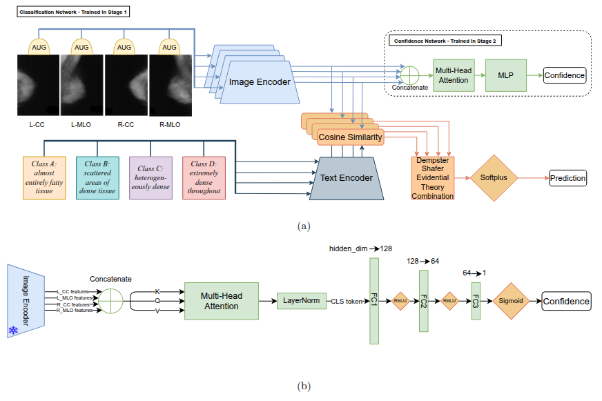

# MMDC-CLIP-F

Code for **[“MMDC-CLIP-F: Vision-Language Multi-View Mammogram Density Classification with Uncertainty Assessment.”](https://doi.org/10.1016/j.neucom.2026.134795)**

<p align="center">
  
</p>

## Abstract

Mammogram density classification is a critical component of breast cancer
screening, as breast density is a well-established risk factor that also
impacts the sensitivity of mammographic imaging. Traditional deep learning
(DL) approaches, such as convolutional neural network (CNN) based models, have
shown limitations in this domain, often struggling with poor inter-class
differentiation and lacking the ability to leverage relational context between
different mammographic views. To address these challenges, we propose a
two-part framework for mammogram density assessment. The first component,
Multi-View Mammogram Density Classification using Contrastive Language-Image
Pretraining (MMDC-CLIP), combines the representational strength of
vision–language models with multi-view fusion. Semantic prompts are used to
inject domain-specific priors, enhancing feature discrimination, while
randomized data augmentation mitigates the challenges of limited annotated
datasets. The second component, a Multi-View Auxiliary Confidence Network
(MV-ACN), processes the final hidden states from all views through a multi-head
attention mechanism to generate calibrated confidence scores, enabling
reliable identification of uncertain cases that may require secondary review.
Together, MMDC-CLIP and MV-ACN form the proposed MMDC-CLIP-F framework. The
MMDC-CLIP classifier using the CLIP ViT-L/14-336 backbone reaches 78.2%
accuracy, 5.9 percentage points higher than MV-DEFEAT, and 91.5% multi-class
AUC, an 8.9-percentage-point improvement, on the RSNA-SMBC dataset. MV-ACN
further provides calibrated uncertainty estimates; when paired with MMDC-CLIP
using the CLIP ViT-B/32 backbone, confidence stratification on RSNA-SMBC yields
93.9% accuracy in high-confidence samples compared with 52.4% in
low-confidence samples. These calibrated confidence estimates enable
downstream decision support, such as deferring low-reliability cases for
radiologist review, thereby improving the safety and interpretability of
automated mammogram density assessment.

## Included code

The repository contains:

- **MMDC-CLIP**, a four-view CLIP breast-density classifier with
  Dempster–Shafer fusion;
- **MV-ACN**, a confidence head trained on frozen CLIP hidden states and true
  class probability (TCP).

MINI-DDSM and RSNA-SMBC are supported with CLIP ViT-L/14-336 and ViT-B/32.
Experiments without code or configs here are outside the repository's scope.

## Installation

The tested environment uses Linux, Python 3.11.9, CUDA 12.1, PyTorch 2.3.1,
torchvision 0.18.1, and Transformers 4.43.4.

```bash
conda env create -f environment.yml
conda activate mmdc-clip-f
mmdc-clip-f --help
```

`environment.yml` installs the package in editable mode. In an existing
compatible environment, use `python -m pip install -e .`. CLIP weights are
downloaded from Hugging Face at their pinned revisions on first use.

## Data

Download the datasets from their original sources:

- [MINI-DDSM](https://www.kaggle.com/datasets/cheddad/miniddsm2)
- [RSNA Screening Mammography Breast Cancer Detection](https://registry.opendata.aws/rsna-screening-mammography-breast-cancer-detection/)

Use this local layout:

```text
data/
├── ddsm/
│   ├── images/
│   └── splits/{train,valid,test}.txt
└── rsna/
    ├── train_images/
    └── splits/{train,valid,test}.csv
```

DDSM manifests are headerless, with one exam per row:

```text
exam_id,L_CC,R_CC,L_MLO,R_MLO,density
```

View paths are relative to `dataset.image_root`; density is an integer from 0
to 3. Images are read directly from the downloaded JPEG hierarchy.

RSNA manifests use this header:

```text
patient_id,density,L_CC,L_MLO,R_CC,R_MLO
```

Density is `A`, `B`, `C`, or `D`. View fields are image IDs resolved as
`<image_root>/<patient_id>/<image_id>.dcm`. DICOM arrays are scaled per image
to uint8, converted to RGB, resized, and normalized. JPEG-2000 decoders are
included in `environment.yml`.

Expected exam counts:

| Dataset | Train | Valid | Test |
|---|---:|---:|---:|
| MINI-DDSM | 1,082 | 271 | 339 |
| RSNA-SMBC | 4,647 | 290 | 872 |

Class counts `(0, 1, 2, 3)` are DDSM `train=(141,398,333,210)`,
`valid=(35,100,83,53)`, `test=(44,125,104,66)` and RSNA
`train=(446,1998,1967,236)`, `valid=(31,129,113,17)`,
`test=(76,384,356,56)`.

Validate files and split isolation before training:

```bash
mmdc-clip-f validate-data \
  --config configs/stage1/ddsm_vit_l_14_336_legacy.yaml
```

The validator checks counts, labels, files, duplicate exams, repeated or
missing views, and overlap between splits. Paths can be changed in YAML or with
`--data-root` and `--manifest-dir`.

## Experiment configs

| Stage-1 config | Dataset | Backbone | Epochs | Fusion pairs |
|---|---|---|---:|---|
| `ddsm_vit_l_14_336_legacy.yaml` | MINI-DDSM | ViT-L/14-336 | 100 | CC, then MLO |
| `ddsm_vit_b_32_legacy.yaml` | MINI-DDSM | ViT-B/32 | 100 | CC, then MLO |
| `rsna_vit_l_14_336_legacy.yaml` | RSNA-SMBC | ViT-L/14-336 | 50 | left, then right |
| `rsna_vit_b_32_legacy.yaml` | RSNA-SMBC | ViT-B/32 | 50 | left, then right |

Stage 1 fully fine-tunes CLIP using four density prompts, cross-entropy after DS
fusion, Adam (`lr=1e-7`, `weight_decay=1e-5`), batch size 3, and RandAugment.
Checkpoints are selected by validation batch-mean accuracy.

The original view order differs by dataset:

| Dataset | Input order | Fusion |
|---|---|---|
| MINI-DDSM | `L_CC, R_CC, L_MLO, R_MLO` | bilateral CC, then bilateral MLO |
| RSNA-SMBC | `L_CC, L_MLO, R_CC, R_MLO` | left views, then right views |

The code uses named views and records these pairs explicitly.

Matching MV-ACN configs are in `configs/confidence/`. DDSM uses 50 epochs and
RSNA 20; both use batch size 6, Adam at `1e-4`, four-head attention, a
`hidden_dim -> 128 -> 64 -> 1` MLP, and MSE against TCP. ViT-L retains view CLS
tokens with dropout 0.3; ViT-B removes them with dropout 0.2.

The ViT-L legacy configs select the confidence checkpoint on test, matching the
original runs. This is biased and requires `--allow-test-selection`. For new
experiments, copy the config, select on `valid`, omit that flag, and reserve
test data for later analysis. ViT-B already selects on validation.

## Train MMDC-CLIP

```bash
STAGE1_CONFIG=configs/stage1/ddsm_vit_l_14_336_legacy.yaml

mmdc-clip-f train-classifier --config "$STAGE1_CONFIG"
```

The command prints the new run directory. Set it before building TCP targets:

```bash
STAGE1_RUN=runs/stage1/ddsm-vit-l-14-336/REPLACE_WITH_RUN_ID
```

## Train MV-ACN

Generate TCP targets from that exact Stage-1 checkpoint:

```bash
CONF_CONFIG=configs/confidence/ddsm_vit_l_14_336_legacy.yaml
TCP_ROOT=artifacts/tcp/ddsm-vit-l-14-336

mmdc-clip-f build-tcp \
  --config "$CONF_CONFIG" \
  --stage1-config "$STAGE1_CONFIG" \
  --stage1-run-dir "$STAGE1_RUN" \
  --output-root "$TCP_ROOT" \
  --splits train test
```

Train MV-ACN:

```bash
mmdc-clip-f train-confidence \
  --config "$CONF_CONFIG" \
  --stage1-config "$STAGE1_CONFIG" \
  --stage1-run-dir "$STAGE1_RUN" \
  --tcp-root "$TCP_ROOT" \
  --allow-test-selection
```

## Citation

If you use this work, please cite:

```bibtex
@article{Schaffer_2026,
  title     = {{MMDC-CLIP-F}: Vision-language multi-view mammogram density classification with uncertainty assessment},
  author    = {Schaffer, Jacob and Zhang, Wandong and Ni, Tianqi and Yang, Yimin and Kulkarni, Ameya Madhav and Saha, Ashirbani},
  journal   = {Neurocomputing},
  volume    = {704},
  pages     = {134795},
  year      = {2026},
  month     = dec,
  doi       = {10.1016/j.neucom.2026.134795},
  url       = {https://doi.org/10.1016/j.neucom.2026.134795},
  issn      = {0925-2312},
  publisher = {Elsevier BV}
}
```
