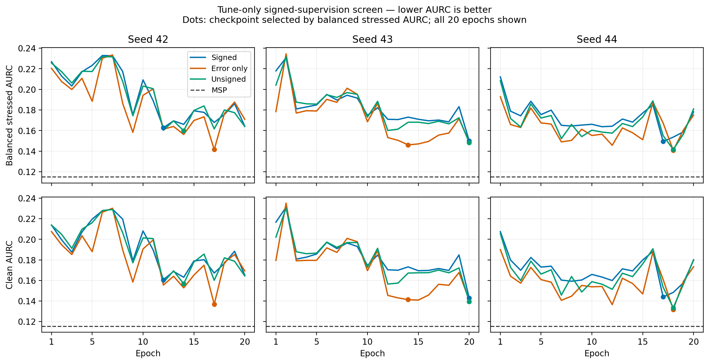

# Matched signed-supervision development screen

This is real RSNA confidence-fit/tune evidence. It does not qualify the full P5B pilot or establish publication-level generalization.

The epoch-38 classifier stayed frozen. Each head used 987 confidence-fit exams, 20 epochs, seeds 42/43/44, identical draws/shared initialization, Adam 1e-4, weight decay 0 and batch size 6. Screening uses 370 tune exams in clean plus 16 allowed noise/blur cells. No pilot or locked test outcomes were accessed.

MSP reference: clean AURC **0.115488**, balanced stressed AURC **0.115037**. Clean classifier accuracy: **78.38%**. The MSP scores are the same deterministic reference for all seeds.

Lower AURC and Brier are better; higher error AUROC is better. Balanced metrics equally weight the 16 cells. Seed variation is not a confidence interval.

## Tune-selected checkpoints

| Method | Seed | Epoch | Clean AURC | Stressed AURC | Stressed error AUROC | Stressed Brier |
|---|---:|---:|---:|---:|---:|---:|
| Signed | 42 | 12 | 0.160637 | 0.162719 | 0.5835 | 0.1706 |
| Error only | 42 | 17 | 0.136779 | 0.141520 | 0.6375 | 0.1698 |
| Unsigned | 42 | 14 | 0.156722 | 0.159812 | 0.5899 | 0.1712 |
| Signed | 43 | 20 | 0.142818 | 0.150087 | 0.6264 | 0.1699 |
| Error only | 43 | 14 | 0.141280 | 0.146117 | 0.6377 | 0.1698 |
| Unsigned | 43 | 20 | 0.139465 | 0.148207 | 0.6279 | 0.1696 |
| Signed | 44 | 17 | 0.143971 | 0.149445 | 0.6119 | 0.1704 |
| Error only | 44 | 18 | 0.131690 | 0.140759 | 0.6458 | 0.1694 |
| Unsigned | 44 | 18 | 0.133435 | 0.141617 | 0.6376 | 0.1698 |

| Signed relative AURC reduction (%) | vs error only | vs unsigned | vs MSP | Clean Δ vs MSP |
|---|---:|---:|---:|---:|
| Seed 42 | -14.98 | -1.82 | -41.45 | +0.045149 |
| Seed 43 | -2.72 | -1.27 | -30.47 | +0.027330 |
| Seed 44 | -6.17 | -5.53 | -29.91 | +0.028482 |

## Fixed epoch 20

| Method | Seed | Epoch | Clean AURC | Stressed AURC | Stressed error AUROC | Stressed Brier |
|---|---:|---:|---:|---:|---:|---:|
| Signed | 42 | 20 | 0.165072 | 0.164224 | 0.5726 | 0.1712 |
| Error only | 42 | 20 | 0.169278 | 0.170866 | 0.5733 | 0.1707 |
| Unsigned | 42 | 20 | 0.164391 | 0.163953 | 0.5838 | 0.1708 |
| Signed | 43 | 20 | 0.142818 | 0.150087 | 0.6264 | 0.1699 |
| Error only | 43 | 20 | 0.140947 | 0.149107 | 0.6288 | 0.1686 |
| Unsigned | 43 | 20 | 0.139465 | 0.148207 | 0.6279 | 0.1696 |
| Signed | 44 | 20 | 0.179648 | 0.178196 | 0.5379 | 0.1719 |
| Error only | 44 | 20 | 0.173357 | 0.175002 | 0.5717 | 0.1713 |
| Unsigned | 44 | 20 | 0.180184 | 0.181053 | 0.5533 | 0.1711 |

| Signed relative AURC reduction (%) | vs error only | vs unsigned | vs MSP | Clean Δ vs MSP |
|---|---:|---:|---:|---:|
| Seed 42 | +3.89 | -0.16 | -42.76 | +0.049583 |
| Seed 43 | -0.66 | -1.27 | -30.47 | +0.027330 |
| Seed 44 | -1.82 | +1.58 | -54.90 | +0.064159 |

## Prespecified screening decision

Promising balanced-AURC seeds (≥5% versus both learned controls and MSP): **[]**.

Seeds within the diagnostic clean MSP +0.005 bound: **[]**. Fixed-epoch signed gains versus all three references: **[]**.

The prespecified promising-signal heuristic **is not satisfied**. It is a development filter, not a statistical significance claim. The full protocol's same-seed clean MV-ACN reference was not fitted.

## Signed-effect diagnostics

Each row aggregates the 17 tune cells; repeated views/cells are not independent patients. Raw auxiliary predictions exclude the deterministic unchanged-prediction overwrite. Constrained output can appear better because unchanged classifier predictions imply zero effect by construction.

| Seed | Raw damage recall | Raw unchanged recall | Raw repair recall | Raw balanced accuracy | Constrained balanced accuracy |
|---|---:|---:|---:|---:|---:|
| 42 | 0.0000 | 1.0000 | 0.0000 | 0.3333 | 0.3333 |
| 43 | 0.0000 | 1.0000 | 0.0000 | 0.3333 | 0.3333 |
| 44 | 0.0000 | 1.0000 | 0.0000 | 0.3333 | 0.3333 |

## Limits and next decision

The 20 checkpoints were screened on the same tune patients used to select the frozen classifier. These results are optimistic development evidence. Neither paired-patient significance nor transfer to held-out corruption families, missing-view panels, an independent pilot or test has been established.

The strongest mandatory same-input MLP/density, original/matched MV-ACN, ViLU and evidential/calibrated controls remain pending. A positive signed-versus-control screen would justify completing them; an inconsistent signed advantage would require a separate research decision rather than outcome-driven retuning. This screen reports all seeds and fixed-budget outcomes.

## Research assessment

The signed hypothesis does not pass this screen. With tune selection, the signed
head is worse than both learned controls in every seed, and all three learned
heads are worse than MSP. Across seeds, balanced AURC is 0.15408 for signed,
0.14280 for error only, 0.14988 for unsigned, and 0.11504 for MSP. Fixed epoch 20
also leaves all methods worse than MSP. No seed meets the prespecified promising
signal or the diagnostic clean bound.

All three selected signed heads predict unchanged for every one of the 25,160
valid tune removal pairs. Damage and repair recall are zero; raw balanced
accuracy is 1/3. The 94.67% majority-unchanged accuracy must not be presented as
successful effect learning. These are repeated cells/views, not 25,160 patients.

Do not launch the full P5B benchmark or write a manuscript around the current
signed-error target on the strength of these results. A small, separately
authorized training/optimization sanity check could distinguish a poorly
optimized common head from a weak auxiliary objective, because even the
error-only control trails MSP. Any target or method redesign requires a new
research decision and a new frozen experiment; it must not be an attempt to
turn this negative screen into a publication through selective reporting.

This evidence rejects the current recipe as ready for the full study. It does
not establish that every possible intervention-supervised confidence method
fails. Preserve the infrastructure and reserve pilot/test outcomes for a method
that demonstrates a credible positive development signal.
